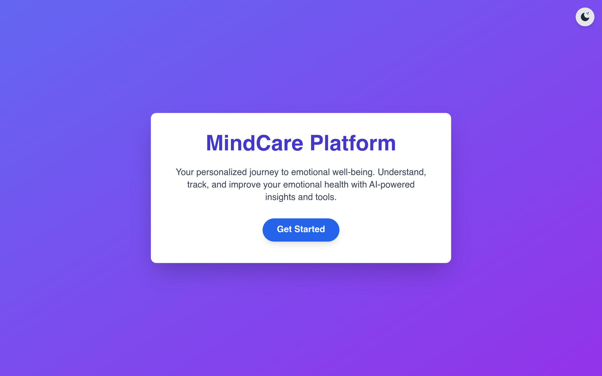
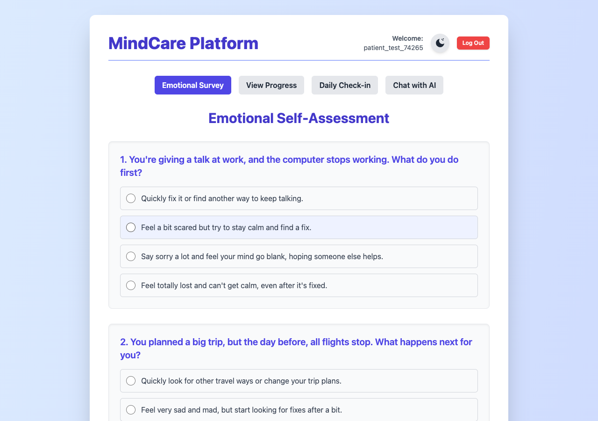
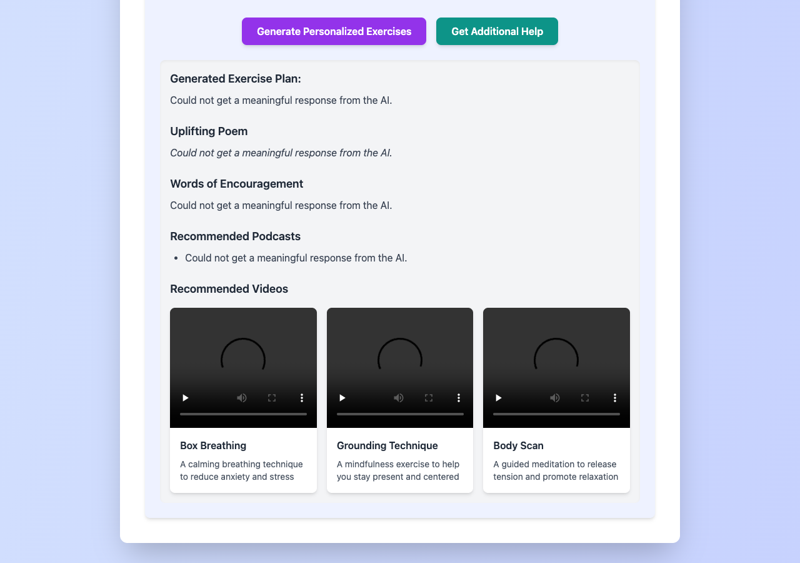
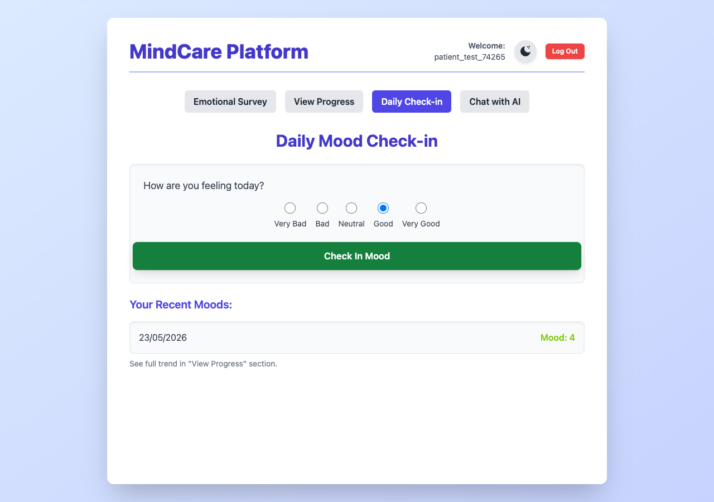
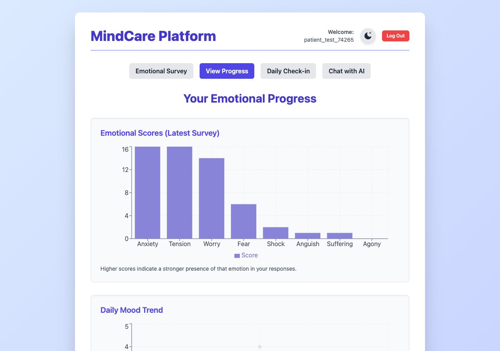
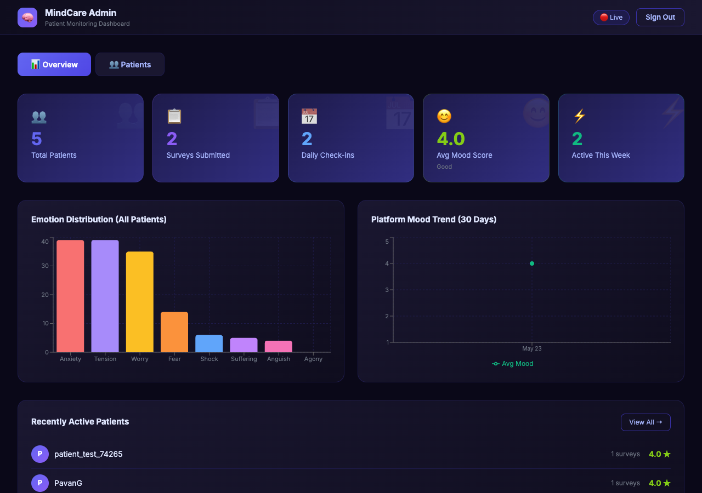
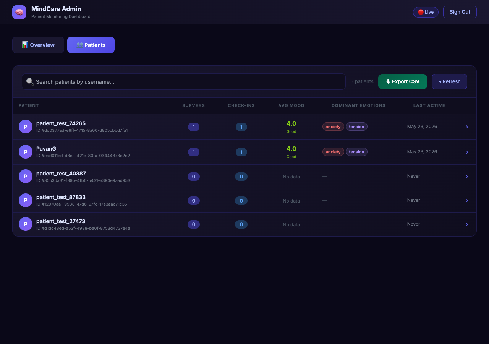
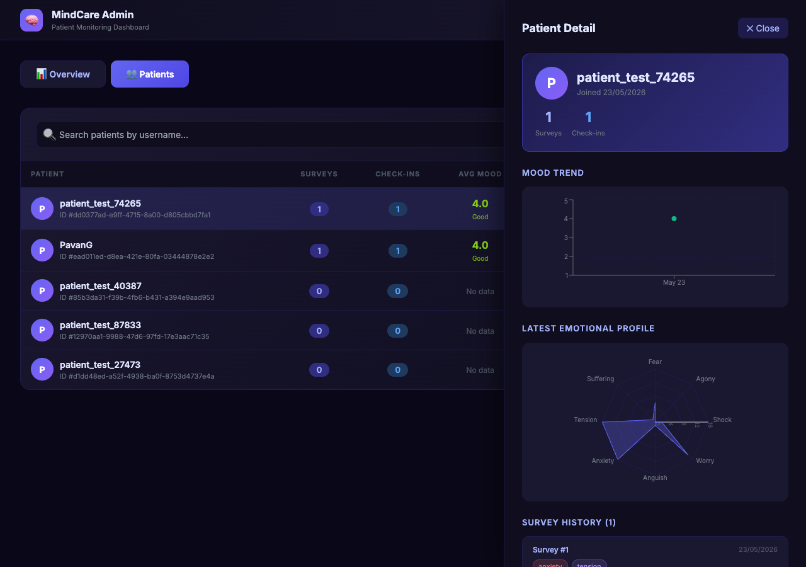

# 🧠 MindCare Platform — Emotional Insights & Support

[](https://emotion-support.netlify.app)

MindCare is a modern, responsive, full-stack web application designed to help individuals track, understand, and manage their emotional health. By leveraging an interactive 15-scenario Emotional Self-Assessment, AI-driven insights, daily mood trackers, and responsive charts, users gain deeper awareness of their stress responses.

It also features a premium **Admin Monitoring Dashboard** enabling clinicians or platform administrators to search patients, view real-time platform averages, analyze individual patient history via slide-in drawers, and export clinical reports.

---

## 🌐 Live Web Application

The platform is deployed and fully operational at:
👉 **[https://emotion-support.netlify.app](https://emotion-support.netlify.app)**

---

## 📸 Visual Walkthrough

### 🔑 Landing & Login Page
A premium, glassmorphic dark-mode landing interface with dynamic micro-animations, integrated with email-mask authentication and a **"Continue with Google"** OAuth flow.



### 📋 Emotional Survey Self-Assessment
An interactive 15-scenario questionnaire designed to assess how individuals react to challenging stressors.



### 🤖 AI Personalized Insights & Plans
Integrates the Gemini API dynamically to generate personalized exercise regimes, motivational poems, uplifting quotes, custom podcast suggestions, and embedded mindfulness yoga tutorials.



### 📅 Daily Mood Check-in
Enables quick daily mood logging to track subjective well-being indexes.



### 📊 Patient Analytical Progress Charts
Visualizes survey-derived emotional profiles and daily mood trajectories using responsive charts (Bar charts & Line charts).



### 🛡️ Clinician/Admin Overview Dashboard
Consolidates platform performance metrics, calculating averages, unique active clinical rates, and overall emotion frequency distributions.



### 👥 Interactive Patient Roster
Allows clinicians to search patients, analyze aggregated survey counts, check-in history, average mood levels, and export full reports.



### 📑 Slide-out Patient Analytical Drawer
Clicking any patient opens an inline, full-height sliding drawer presenting their entire clinical progress chart, mood fluctuations, and historical survey assessments.



---


## 🛠️ Technology Stack

* **Frontend**: React 19, Vite 8 (Rolldown bundler), Tailwind CSS 3, Recharts (responsive data visualization).
* **Backend**: Node.js, Express.js REST API, PostgreSQL client (`pg`), CORS, JWT Authentication (`jsonwebtoken`), Password Hashing (`bcryptjs`).
* **Database**: PostgreSQL 16+ relational schema (Users, Survey Results, Daily Mood Check-ins).
* **AI Engine**: Gemini 2.0 Flash integration for custom exercise plan drafting, poem creation, motivational messaging, and podcast recommendations.

---

## 📁 Project Structure

```
├── dist/                    # Production client build output
├── public/                  # Static assets and video tutorials
├── server/                  # Backend REST API
│   ├── middleware/          # Express route auth guards
│   ├── routes/              # Auth, Results, and Admin controller paths
│   ├── db.js                # pg client pool initialization
│   ├── index.js             # Express app core
│   ├── schema.sql           # Database table schemas and seed scripts
│   └── package.json         # Backend package definitions
├── src/                     # React 19 Frontend
│   ├── App.jsx              # Client router, survey form, and chatbot
│   ├── admin/               # Modular clinician analytics dashboard
│   │   ├── utils.js         # Color configurations and mood rating maps
│   │   ├── StatCard.jsx     # Overview metrics widgets
│   │   ├── PatientRow.jsx   # Interactive patient records table rows
│   │   ├── PatientDrawer.jsx# Detailed patient analytical visual drawers
│   │   └── AdminPanel.jsx   # Core dashboard layout and data controller
│   ├── index.css            # Stylesheets & Tailwind configuration
│   └── index.jsx            # React client mounting entry
├── vite.config.js           # Vite 8 / Rolldown build configurations & proxy maps
├── tailwind.config.js       # Styling definitions
├── .env.server.example      # Environment variables blueprint for the server
└── README.md                # Project documentation
```

---

## 🚀 Getting Started

### 1. Database Setup
Ensure you have PostgreSQL running, create the database, and run the schema definitions:

```bash
# Start your PostgreSQL service
brew services start postgresql@16

# Create the database
createdb mindcare_db

# Populate the schema (indexes, tables, and default seed admin user)
psql -d mindcare_db -f server/schema.sql
```

### 2. Backend API Setup
Navigate to the `server` directory, configure your environment variables, and start the development server:

```bash
cd server
npm install

# Copy example environment configuration
cp ../.env.server.example .env.server
```

Edit the `.env.server` file to fill in your PostgreSQL credentials and a secure JWT secret:
```ini
DB_HOST=localhost
DB_PORT=5432
DB_NAME=mindcare_db
DB_USER=your_postgres_username
DB_PASSWORD=your_postgres_password
JWT_SECRET=your_super_secret_jwt_random_string
PORT=4000
FRONTEND_URL=http://localhost:3000
```

Start the backend:
```bash
npm run dev # Launches nodemon server
```
The Express server will start listening on `http://localhost:4000`.

### 3. Frontend App Setup
Return to the root folder, configure client environments, and launch the dev environment:

```bash
cd ..
npm install
```

Configure your client `.env`:
```ini
VITE_API_KEY=your_gemini_api_key_here
VITE_API_URL=http://localhost:3000
```

Launch the Vite server:
```bash
npm run dev
```
Open **[http://localhost:3000](http://localhost:3000)** in your browser. All frontend requests to `/api/*` are automatically proxied to `http://localhost:4000` to prevent CORS issues.

---

## 👤 Login & Admin Roles

### 🧑‍⚕️ Patient Experience
* Create any regular user through the **Register** tab.
* Complete the **15-scenario Emotional Survey** to generate live emotional score bar charts and get tailored mental exercise suggestions.
* Log daily moods using the **Daily Check-in** tab to track mood trends over time.
* Chat with the supportive **AI Chatbot** to ask questions and receive empathetic guidance.

### 🛡️ Admin/Clinician Experience
To inspect platform stats and patient histories, log in with the pre-seeded admin user:
* **Username**: `admin`
* **Password**: `admin123`

The Admin interface allows you to:
* View aggregated counts of **Total Patients**, **Surveys**, **Daily Check-ins**, and **Avg Platform Mood**.
* Trace platform **Mood Trends** and **Emotion Frequency Distributions** using detailed charts.
* Search patients by name and **Export a clinical CSV report** detailing all metrics.
* Click on any patient row to open a **Slide-in Detail Drawer**, revealing a **Mood Trend line graph**, an **Emotional Profile Radar Chart**, and a history log of all past surveys with their raw responses and assessments.
